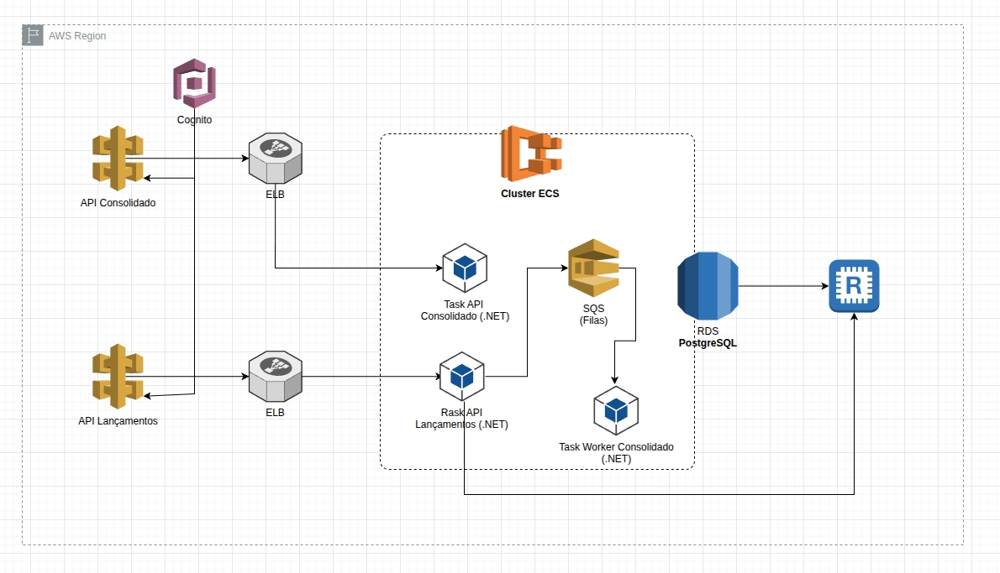

# Sistema de Controle de Fluxo de Caixa - Merchant Processing

## Índice

1. [Descrição da Arquitetura](#1-descrição-da-arquitetura)
2. [Acesso ao Código, Preparação do Ambiente e Deploy](#2-acesso-ao-código-preparação-do-ambiente-e-deploy)

---

## 1. Descrição da Arquitetura

### Requisitos do exercício

1. **Funcional**: "1 (um) comerciante precisa controlar o seu fluxo de caixa diário com os lançamentos (débitos e créditos), também precisa de um relatório que disponibilize o saldo diário consolidado."

2. **Performance**: "O serviço de controle de lançamento não deve ficar indisponível se o sistema de consolidado diário cair. Em dias de picos, o serviço de consolidado diário recebe 50 requisições por segundo, com no máximo 5% de perda de requisições."

### Arquitetura recomendada



**Solução hospedada na AWS**

### Características da arquitetura

#### Escalabilidade
Microsserviços .NET 8 rodando em tasks no ECS. Todos os microsserviços podem rodar de 1 até 10 tasks com auto-scaling baseado em CPU / RequestCountPerTarget.

#### Balanceamento de carga
**Amazon API Gateway** como entry point único com autenticação JWT/Cognito, rate limiting (55 TPS), cache de respostas e WAF integrado. **Application Load Balancer** independente para cada serviço em VPC privada, conectados via VPC Link.

#### Estratégia de Cache
Uso do Redis (ElastiCache) para cache de saldo atual e consolidado diário (reduz carga do banco em até 10x). PostgreSQL RDS com read replica para separar leitura/escrita. Cache em três camadas: API Gateway (edge) → Redis (aplicação) → Database (replica).

#### Resiliência
ALB detecta instâncias não saudáveis e redireciona tráfego. Multi-instâncias de cada serviço (Multi-AZ no ECS). Retry policy com Polly. Idempotência garante retry seguro. Serviço de Lançamentos continua funcionando se Consolidado cair (independência via SQS).

#### Segurança
APIs protegidas via API Gateway com AWS IAM/Cognito, tokens JWT, HTTPS/TLS. Rate limit (proteção contra ataques de flood). WAF (Web Application Firewall). Criptografia em trânsito e em repouso. Logs no CloudWatch (auditoria).

#### Padrões arquiteturais
Serão 3 microsserviços: **API Lançamentos**, **API Consolidado** e **Worker Consolidador**, independentes e escaláveis.

- **CQRS**: Separação de comandos (write) e queries (read)
- **Event-Driven Architecture**: SQS para comunicação assíncrona
- **Publish-Subscribe**: Lançamentos publica eventos, Worker subscreve e atualiza totais
- **Materialized View**: ConsolidatedDaily pré-calculado para queries rápidas
- **Repository Pattern**: Domain models independentes do EF Core

#### Integração
Protocolos HTTPS/REST. Uso de JSON nas mensagens da fila SQS. Contratos de API com DTOs, versionamento (v1, v2) e Swagger/OpenAPI.

#### Confiabilidade
- **Idempotência**: Zero duplicação de transações
- **ACID**: Consistência de saldo garantida
- **Message durability**: SQS persiste mensagens (14 dias)
- **Retry policies**: Polly com exponential backoff
- **DLQ**: Mensagens problemáticas isoladas para análise

---

## 2. Acesso ao Código, Preparação do Ambiente e Deploy

### 2.1. Acesso ao repositório

**Repositório GitHub**: https://github.com/tnnovak/exercicio-arq

```bash
git clone https://github.com/tnnovak/exercicio-arq.git
cd exercicio-arq
```

**Estrutura atual do repositório**:
```
exercicio-arq/
├── README.md                                  # Documentação da arquitetura
├── desenho-arq.jpg                           # Diagrama da arquitetura
├── desafio-arquiteto-software-out2024 1.pdf  # Especificação do desafio
└── src/                                      # (A ser implementado)
    ├── MerchantProcessing.Lancamentos.Api/
    ├── MerchantProcessing.Consolidado.Api/
    ├── MerchantProcessing.Consolidator.Worker/
    ├── MerchantProcessing.Domain/
    ├── MerchantProcessing.Infrastructure/
    ├── tests/
    └── infrastructure/                       # Terraform files
```

### 2.2. Como buildar e rodar localmente

**Pré-requisitos**: .NET 8 SDK, Docker Desktop, AWS CLI

**Executar com Docker Compose**:

```bash
# Subir dependências (PostgreSQL, Redis, LocalStack para SQS)
docker-compose up -d

# Aplicar migrations
dotnet ef database update --project src/MerchantProcessing.Lancamentos.Api

# Rodar serviços
dotnet run --project src/MerchantProcessing.Lancamentos.Api
dotnet run --project src/MerchantProcessing.Consolidado.Api
dotnet run --project src/MerchantProcessing.Consolidator.Worker
```

**Build de imagens Docker**:

```bash
docker build -f src/MerchantProcessing.Lancamentos.Api/Dockerfile -t lancamentos-api:latest .
docker build -f src/MerchantProcessing.Consolidado.Api/Dockerfile -t consolidado-api:latest .
docker build -f src/MerchantProcessing.Consolidator.Worker/Dockerfile -t consolidator-worker:latest .
```

### 2.3. Criar infraestrutura na AWS

**Usando Terraform**:

```bash
cd infrastructure/terraform
terraform init
terraform plan -out=tfplan
terraform apply tfplan
```

**Recursos criados**: VPC, RDS PostgreSQL + replica, ElastiCache Redis, ECS Cluster, ALBs, API Gateway, SQS, Cognito, CloudWatch, IAM roles e Security Groups.

### 2.4. Pipeline CI/CD e integração com AWS ECR

**GitHub Actions** (`.github/workflows/deploy.yml`):

```yaml
name: Deploy to AWS ECS
on:
  push:
    branches: [main]
jobs:
  deploy:
    runs-on: ubuntu-latest
    steps:
      - uses: actions/checkout@v3
      - name: Configure AWS credentials
        uses: aws-actions/configure-aws-credentials@v2
        with:
          aws-access-key-id: ${{ secrets.AWS_ACCESS_KEY_ID }}
          aws-secret-access-key: ${{ secrets.AWS_SECRET_ACCESS_KEY }}
          aws-region: us-east-1
      - name: Login to Amazon ECR
        id: login-ecr
        uses: aws-actions/amazon-ecr-login@v1
      - name: Build and push
        run: |
          docker build -f src/MerchantProcessing.Lancamentos.Api/Dockerfile \
            -t ${{ steps.login-ecr.outputs.registry }}/lancamentos-api:${{ github.sha }} .
          docker push ${{ steps.login-ecr.outputs.registry }}/lancamentos-api:${{ github.sha }}
```

### 2.5. Criar e publicar imagens Docker no ECR

```bash
# Criar repositórios ECR
aws ecr create-repository --repository-name lancamentos-api
aws ecr create-repository --repository-name consolidado-api
aws ecr create-repository --repository-name consolidator-worker

# Autenticar no ECR
aws ecr get-login-password --region us-east-1 | \
  docker login --username AWS --password-stdin <account-id>.dkr.ecr.us-east-1.amazonaws.com

# Tag e push
docker tag lancamentos-api:latest <account-id>.dkr.ecr.us-east-1.amazonaws.com/lancamentos-api:v1.0.0
docker push <account-id>.dkr.ecr.us-east-1.amazonaws.com/lancamentos-api:v1.0.0
```

### 2.6. Deploy ECR → ECS

**Deploy manual**:

```bash
# Atualizar task definition
aws ecs register-task-definition --cli-input-json file://task-definition.json

# Forçar novo deployment
aws ecs update-service --cluster merchant-cluster \
  --service lancamentos-api-service --force-new-deployment
```

**Deploy automático via pipeline**: Push na branch `main` → build e push para ECR → ECS service atualizado com rolling update (zero downtime).

**Verificação**:

```bash
aws ecs describe-services --cluster merchant-cluster --services lancamentos-api-service
aws logs tail /ecs/lancamentos-api --follow
curl https://api.merchant.com/health
```


